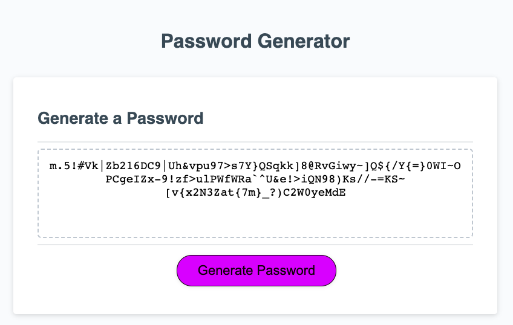

# Password Generator
### [View Project Here](https://twixmixyjanet.github.io/password-generator/ "Password Generator") 

| Technology Used    | Resource URL |
| --------  | ------- |
| HTML      | https://developer.mozilla.org/en-US/docs/Web/HTML |
| CSS       | https://developer.mozilla.org/en-US/docs/Web/CSS |
| JavaScript | https://developer.mozilla.org/en-US/docs/Web/JavaScript |
| Git       | https://git-scm.com/ |
| VSCode    | https://code.visualstudio.com/ |

## Table of Contents

* [Description](#description)
* [Installation](#installation)
* [Usage](#usage)
* [Credits](#credits)
* [License](#license)

## Description:

#### User Story
- AS AN employee with access to sensitive data
- I WANT to randomly generate a password that meets certain criteria
- SO THAT I can create a strong password that provides greater security

#### Acceptance Criteria
- GIVEN I need a new, secure password
- WHEN I click the button to generate a password
- THEN I am presented with a series of prompts for password criteria
- WHEN prompted for password criteria
- THEN I select which criteria to include in the password
- WHEN prompted for the length of the password
- THEN I choose a length of at least 8 characters and no more than 128 characters
- WHEN asked for character types to include in the password
- THEN I confirm whether or not to include lowercase, uppercase, numeric, and/or special characters
- WHEN I answer each prompt
- THEN my input should be validated and at least one character type should be selected
- WHEN all prompts are answered
- THEN a password is generated that matches the selected criteria
- WHEN the password is generated
- THEN the password is either displayed in an alert or written to the page

### Lessons Learned

#### FIRST ATTEMPT
// ~ What I learned from this attempt is that there are "many ways to pet a cat". Ultimately I was attempting to engineer it in a very backwards way which I had to individually account for each potential issue. Which means there is more chance of the code breaking (which it did as I never got it fully working). After sitting in on study sessions, going through the code drills, reviewing online best practices, and working through class activities, I think I found some better methods of "petting this cat". I learned a lot along the way and I hope it's illustrative above in the comments I made about my statements made. ~ //

#### SECOND ATTEMPT
// ~ I'm still trying to grasp some of the fundamentals. I went DRY this time and tried to make it as simple as possible. However, I still did some over engineering by hi-jacking the starter code because I couldn't think of how else to accomplish the task to initiate the functions that I had written. I was able to get everything to function through the for loop, but I was not able to implement a fail safe for if the user selected no character options. ~ //

#### THIRD ATTEMPT
// ~ I worked with a tutor to review my work. We re-engineered my if statement confirms to be variables, so that we could store the true/false result. We then collected the results into an object, so that we could pass them to another function and use them in a for loop to make the giant array and then randomly select the characters from there.

## Installation

1. Create a new repository on GitHub, to store this project.
2. Clone the repository to your computer.
3. Copy files to your own repository.
4. Make changes to the code.
5. Commit the changes to the local repo.
6. Push the changes to the remote repo.

## Usage

This one page website portfolio can be used as a base template. Simply swap out information, work, skills, and contact you may need for it to match your requirements.

## License

MIT License
Copyright (c) 2023 Twixmixy / Janet Webster

## About The Author
### Janet Webster
Full Stack MERN Software Engineer in training.

- [GitHub](https://github.com/TwixmixyJanet/)
- [LinkedIn](https://www.linkedin.com/in/twixmixy/)
- [Twitter](https://twitter.com/Twixmixy)
- [WakaTime](https://wakatime.com/@Twixmixy)

